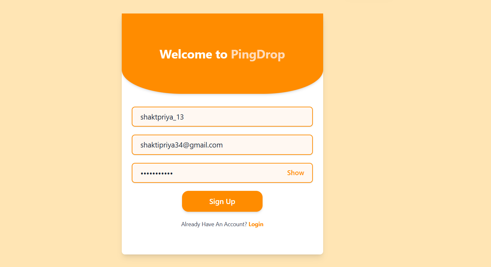

# PingDrop: Real-Time Chat Application



## Overview

PingDrop is a modern, real-time chat application built using the **MERN stack** (MongoDB, Express.js, React, Node.js) and **Socket.io** for seamless, WhatsApp-style 1:1 messaging. This full-stack project, designed for 2025, integrates advanced features like real-time messaging, live typing indicators, online status updates, and image uploads via **Cloudinary** . With a fully responsive design and robust user authentication, PingDrop is an excellent addition to any developer's portfolio, showcasing expertise in real-time web development and the MERN stack.

The application includes a sleek frontend powered by **React** and **Redux Toolkit** , a secure backend with **Node.js** and **Express.js** , and a scalable database with **MongoDB** and **Mongoose** . Deployed on **Render** for both frontend and backend, and using **MongoDB Atlas** for the database, PingDrop delivers a high-performance, real-time chat experience.

---

## Features

- **Real-Time Messaging** : Powered by Socket.io for instant 1:1 messaging.
- **User Authentication** : Secure login and signup with JWT-based authentication.
- **Live Typing Indicators** : Real-time feedback when users are typing.
- **Online Status** : Displays active users in real-time.
- **Image Uploads** : Upload and share images via Cloudinary integration.
- **Responsive Design** : Optimized for both mobile and desktop devices.
- **Search Functionality** : Easily find users to start conversations.
- **Data Management** : MongoDB and Mongoose for efficient storage of chats and user data.
- **State Management** : Redux Toolkit for a smooth and scalable frontend experience.

---

## Tech Stack

- **Frontend** : React.js, Redux Toolkit, Tailwind CSS
- **Backend** : Node.js, Express.js
- **Database** : MongoDB, Mongoose
- **Real-Time Communication** : Socket.io
- **Image Management** : Cloudinary API
- **Deployment** : Render (Frontend & Backend), MongoDB Atlas (Database)
- **Other Tools** : Axios, JWT for authentication, bcrypt for password hashing

---

## Project Structure

```
PingDrop/
├── client/                     # React frontend
│   ├── src/
│   │   ├── components/         # Reusable React components
│   │   ├── pages/              # Home, Profile, Login, Signup pages
│   │   ├── redux/              # Redux Toolkit setup (slices, store)
│   │   ├── assets/             # Static assets (images, styles)
│   │   └── App.js              # Main React app component
├── server/                     # Node.js/Express backend
│   ├── routes/                 # API routes (auth, messages, users)
│   ├── models/                 # MongoDB schemas (User, Message, Conversation)
│   ├── controllers/            # API logic
│   ├── middleware/             # Authentication middleware
│   ├── socket/                 # Socket.io logic
│   └── server.js               # Main server file
├── README.md                   # Project documentation
└── package.json                # Project dependencies
```

---

## Installation

Follow these steps to set up PingDrop locally:

### Prerequisites

- Node.js (v16 or higher)
- MongoDB Atlas account
- Cloudinary account and API keys
- Render account for deployment

### Steps

1. **Clone the Repository** :

```bash
   git clone https://github.com/ShaktiPriya/PingDrop.git
   cd PingDrop
```

1. **Install Dependencies** :

- For the frontend:
  ```bash
  cd client
  npm install
  ```
- For the backend:
  ```bash
  cd server
  npm install
  ```

1. **Set Up Environment Variables** :

- Create a `.env` file in the `server` directory:
  ```env
  MONGO_URI=your_mongodb_atlas_connection_string
  JWT_SECRET=your_jwt_secret
  CLOUDINARY_CLOUD_NAME=your_cloudinary_cloud_name
  CLOUDINARY_API_KEY=your_cloudinary_api_key
  CLOUDINARY_API_SECRET=your_cloudinary_api_secret
  ```

1. **Run the Application** :

- Start the backend server:
  ```bash
  cd server
  npm start
  ```
- Start the frontend:
  ```bash
  cd client
  npm start
  ```

1. **Access the App** :

- Frontend: `http://localhost:3000`
- Backend APIs: `http://localhost:5000`

---

## Usage

### For Users

- **Sign Up/Login** : Create an account or log in to access the chat platform.
- **Start Chatting** : Search for users and initiate 1:1 conversations.
- **Real-Time Features** : Experience live typing indicators and online status updates.
- **Share Media** : Upload images to share within conversations.

### For Developers

- **Explore APIs** : Use the provided RESTful APIs for authentication, messaging, and user search.
- **Socket.io Integration** : Real-time messaging and status updates are handled via Socket.io.
- **Customize** : Extend the app by adding group chats, push notifications, or other features.

---

## API Endpoints

### Authentication

- `POST /api/auth/signup`: Register a new user
- `POST /api/auth/login`: Log in a user
- `GET /api/auth/current-user`: Get details of the authenticated user

### Messages

- `POST /api/messages`: Send a new message
- `GET /api/messages/:conversationId`: Fetch messages for a conversation
- `GET /api/conversations`: Fetch all conversations for the authenticated user

### Users

- `GET /api/users/search`: Search for users by name or email

---

## Socket.io Events

- **connection** : Establishes a Socket.io connection.
- **join** : Joins a user to their Socket.io room.
- **sendMessage** : Sends a real-time message to a recipient.
- **typing** : Emits typing status to other users in the conversation.
- **onlineStatus** : Updates the online status of users.

---

## Deployment

PingDrop is deployed on **Render** for both frontend and backend, with the database hosted on **MongoDB Atlas** . To deploy your own instance:

1. Push your code to a GitHub repository.
2. Connect the repository to Render for both `client` and `server` directories.
3. Set up environment variables in Render’s dashboard.
4. Configure MongoDB Atlas and ensure the connection string is added to the backend environment.
5. Deploy the app and access it via the provided Render URLs.

Visit the deployed app: [PingDrop on Render](https://pingdrop.render.com/) _(update with your deployed URL)_

---

## Screenshots

### Homepage


### Chat Interface


### Profile Page


---

## Contributing

Contributions are welcome! To contribute to PingDrop:

1. Fork the repository.
2. Create a new branch: `git checkout -b feature/your-feature`.
3. Make your changes and commit: `git commit -m "Add your feature"`.
4. Push to the branch: `git push origin feature/your-feature`.
5. Open a pull request.

Please ensure your code follows the project’s coding standards and includes appropriate tests.

---

## License

This project is licensed under the **MIT License** . See the [LICENSE](https://grok.com/chat/LICENSE) file for details.

---

## Author

**ShaktiPriya**

- GitHub: [github.com/ShaktiPriya](https://github.com/shaktipriya13/)
- Email: [shaktipriya34@gmail.com](mailto:shaktipriya34@gmail.com)
- LinkedIn: [linkedin.com/in/shaktipriya13](https://linkedin.com/in/shaktipriya13)

---

## Acknowledgments

- **Socket.io** : For enabling real-time communication.
- **Cloudinary** : For efficient image uploads and management.
- **Render** : For seamless deployment of frontend and backend.
- **MongoDB Atlas** : For a scalable and reliable database solution.
- **MERN Stack Community** : For the robust tools and libraries that power PingDrop.

---

Happy Chatting with PingDrop! 🚀
